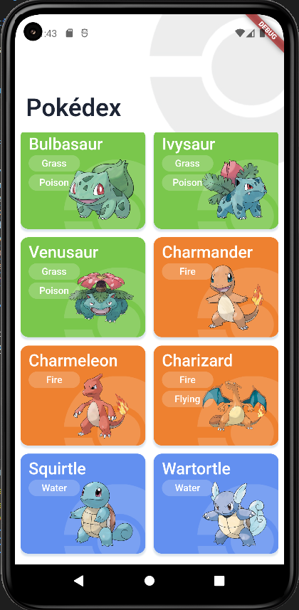
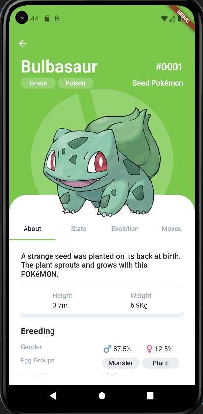
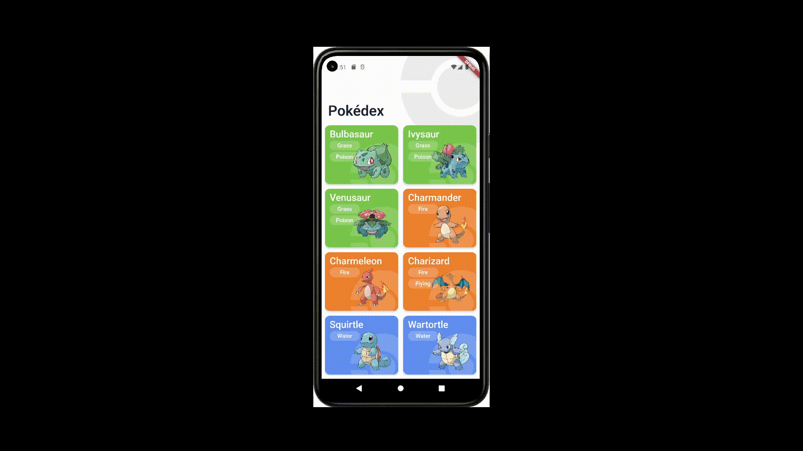

# Pokedex project

## Description

This is a study project of a functional pokedex developed in Flutter with BLoC.

## Screenshots / GIFs

## Queue of features

* Searchbar on **List Page**;
* Filter on **List Page**;
* Carroussel on **Details Page**;
* `Where to find this pokemon` on **Details Page**;
* Improve design of `Move Tab` on **Details Page**;
* See shiny version on **Details Page**;
* Add `Mega` and `Gigantamanx` on `Evolution Tab` of **Details Page**;
* Add `Move Details Page`;
* Add `Animations` to match UI reference;

## UI Reference

The UI of the project is based on [Saepul Nahwan's design](https://dribbble.com/shots/6563578-Pokedex-App-Animation)

